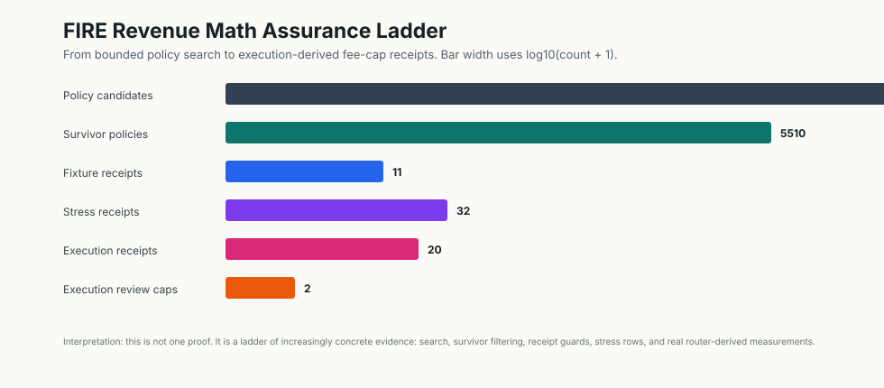
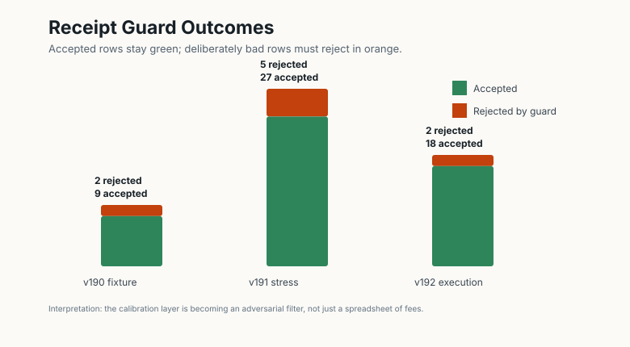
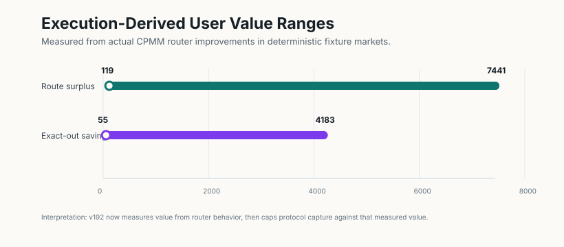
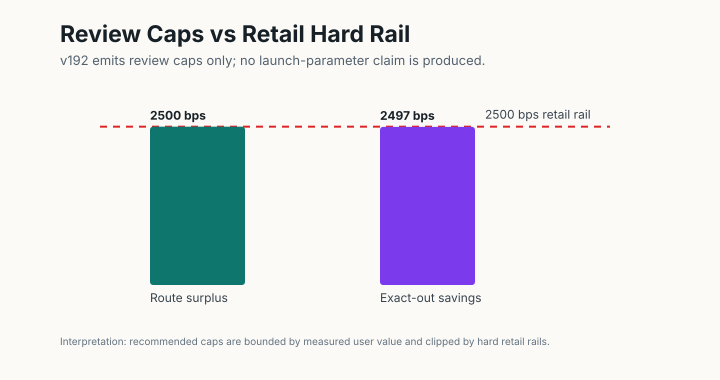

# FIRE Revenue Surface Atlas

This document answers the concrete tokenomics question: where does protocol
revenue actually come from?

The answer should not be "staking." Staking is an allocation and commitment
surface. Revenue comes from fee surfaces where the protocol creates measurable
execution, protection, automation, liquidity, or verification value.

## Revenue Surface Law

For normal user-facing surfaces:

```text
UserFee <= MeasuredUserValue
```

In plain English: the user should not pay more than the value the surface
creates. If the surface cannot measure value, its bps rate should be tiny,
bundled, or turned off.

For protocol surplus surfaces:

```text
ProtocolRevenue <= CapturableProtocolSurplus
```

In plain English: market-maker bots, arbitrage recapture, and solver auctions
can fund the protocol without charging the user directly, but only to the
extent the surplus is real and receipt-backed.

For staking rewards:

```text
StakeRewards <= RevenueBackedRewardBudget + ExplicitSubsidy
```

In plain English: staking distributes funded budget. It is not itself a revenue
source.

## Concrete Fee Surfaces

| Surface | Who pays | Fee basis | Why it can be worth paying |
| --- | --- | --- | --- |
| Swap protocol rake | swap user | bps of notional | baseline use of the DEX |
| Route surplus capture | swap user | bps of measured output improvement | user keeps part of a better route |
| Exact-out savings capture | swap user | bps of saved input | same output costs less than baseline |
| COW/batch solver surplus | solver/user surplus | bps of measured batch surplus | solver improves settlement quality |
| MEV/protection receipt | swap user/integrator | low bps of protected notional or surplus | stale/replay/MEV risk is reduced |
| Automation orders | user | bps of executed notional or saved manual cost | DCA, TWAP, limit, recurring execution |
| Pro certificate/API | integrator | bps of routed volume or surplus | wallets/apps need audit-grade evidence |
| Integrator routing | wallet/app/user | bps of routed volume or surplus | distribution and UX improve flow |
| Treasury market-maker bot | market surplus | bps of bot profit | protocol earns from providing liquidity |
| Arbitrage recapture auction | arbitrageur/solver | bps of auctioned surplus | leakage becomes treasury revenue |
| LP loss-cover premium | protection buyer | bps premium | protocol sells bounded protection |
| Early-exit penalty | broken commitment | capped penalty | protects commitment schedules |

Early-exit penalties are intentionally last. They are not healthy primary
revenue. The v190 oracle rejects policies that depend materially on penalty
revenue.

## Revenue To Deflation

```text
NetRevenue
  = GrossRevenue
  - solver_rewards
  - claims_cost
  - operating_cost
```

In plain English: only net revenue can safely fund burns, treasury, security,
liquidity support, rebates, and lock rewards.

```text
BurnBudget > SubsidyEmissions -> TotalSupply decreases
```

In plain English: lockups reduce liquid float, but only burn greater than
emission reduces total supply.

## Staking User Experience

The first staking product should be a revenue-backed commitment vault:

1. User chooses amount and lock duration.
2. The vault mints non-transferable commitment shares.
3. Protocol revenue funds a reward pool.
4. The reward pool is allocated pro-rata by commitment shares.
5. Rewards are never guaranteed and never exceed funded budget.
6. Early exit is allowed only under a capped, predeclared penalty.

The UI should show:

- current funded reward pool,
- total active commitment shares,
- user's share of active shares,
- maturity date,
- early-exit penalty,
- whether rewards are fee-funded or subsidy-funded.

## v190 Bounded Oracle

The executable cycle is:

```text
experiments/math_object_innovation_v190/
```

It searches a bounded bps grid over concrete fee surfaces and rejects:

- zero-fee policies that cannot fund the protocol,
- extractive notional fees that make user net value negative,
- wash-rebate farms,
- passive-subsidy staking,
- penalty-dependent revenue.

The corresponding Lean algebra packet is:

```text
lean-mathlib/Proofs/RevenueSurfaceSafety.lean
```

That proof covers the small algebraic skeleton. The executable oracle covers
bounded parameter search. Production deployment would still need runtime
receipts for measured value, surplus, wash score, and fee attribution.

Current v190 replay:

```text
candidate_policy_count = 155527
survivor_count = 5510
model_audit.total_model_invariant_failures = 0
mutation_receipt.detected_count = 5 / 5
report_integrity.passed_count = 11 / 11
fee_cap_recommendations.candidate_review_cap_count = 6 / 11
fee_cap_recommendations.launch_parameter_claim_count = 0
```

Best bounded survivor:

```text
policy = grid_090937_max_burn_guarded
net_protocol_revenue = 5322
burn_budget = 4257
deflation_margin = 4257
penalty_dependency_bps = 0
```

Launch-shaped survivor:

```text
policy = fee_surface_launch
net_protocol_revenue = 2258
burn_budget = 1016
total_user_net_value = 3669
```

In plain English: there are revenue-generating fee surfaces that survive the
bounded model without leaning on penalty revenue or passive emissions. The next
question is calibration against real quote/action corpora.

The mutation receipt deliberately corrupts the model in five ways and confirms
the audit layer detects each corruption. That does not prove the economics are
complete; it does prove the accounting audit is sensitive to known-bad bug
classes.

The report-integrity receipt regenerates the bounded search and confirms the
published report is not stale or hand-edited for the counted fields, best
survivor, model audit, and named-policy summaries.

## Receipt Calibration

The fee-surface model depends on measured value. That measurement must come
from receipts, not from intuition.

The v190 calibration bridge accepts JSONL rows with:

```text
surface
fee_source
notional_units
measured_value_units
user_fee_paid_units
protocol_revenue_units
direct_cost_units
recurring
primary_revenue
wash_score_bps
```

In plain English: every fee event must say what surface it belongs to, what
value was measured, what the user paid, what the protocol captured, what direct
costs apply, and whether wash-trade risk makes the row inadmissible.

The fixture replay currently reports:

```text
receipt_count = 11
accepted_count = 9
rejected_count = 2
```

The two rejected rows are deliberate: one charges more than measured value and
one has an excessive wash score. Real deployment should feed actual
quote/action/API receipts into the same calibrator before setting launch fee
caps.

The fee-cap recommendation layer converts accepted user-paid receipt surfaces
into review-stage caps only:

```text
CandidateReviewCap:
  user_fee_paid <= measured_user_value
  ∧ recommended_cap <= hard_value_cap
  ∧ launch_parameter_claim = false
```

In plain English: the recommendation artifact can say "this fee cap is worth
reviewing," but it cannot claim the cap is ready to launch. Protocol-surplus
surfaces and penalties are kept out of user-paid fee-cap recommendations.

Current fixture replay:

```text
surface_count = 11
candidate_review_cap_count = 6
protocol_surplus_internal_capture = 2
penalty_not_primary_revenue = 1
rejected_only = 2
total_recommendation_invariant_failures = 0
```

## Synthetic Stress Corpus

The v191 stress corpus adds a stronger model-bug guard around the same bridge:

```text
receipt_count = 32
accepted_count = 27
rejected_count = 5
candidate_review_cap_count = 6
launch_parameter_claim_count = 0
total_stress_invariant_failures = 0
```

In plain English: the bridge now has a deterministic multi-sample regression
corpus. It includes three accepted samples for each user-paid fee surface and
five bad rows that must reject for exact reasons: extractive user fees,
protocol-surplus overcapture, primary penalty revenue, wash farming, and
primary negative net revenue.

The stress corpus is still not market calibration. It is a model-bug harness
that should remain stable while real quote/action/API receipts are added.

## Execution-Derived Receipts

The v192 replay connects the same calibration bridge to actual CPMM routing
arithmetic:

```text
RouteSurplusValue := best_route_amount_out - direct_route_amount_out
ExactOutSavingsValue := direct_route_amount_in - best_route_amount_in
```

In plain English: the receipt value is measured from the router's improvement
over a direct route in deterministic CPMM fixture markets.

Current replay:

```text
receipt_count = 20
accepted_count = 18
rejected_count = 2
route_receipt_count = 9
exact_out_receipt_count = 9
candidate_review_cap_count = 2
launch_parameter_claim_count = 0
total_execution_receipt_invariant_failures = 0
```

Runtime-derived measured ranges:

```text
route_improvement = 119 .. 7441
exact_out_savings = 55 .. 4183
```

This is still fixture-based, not live telemetry. The improvement is that the
measured value in these receipts now comes from the same router arithmetic used
by ZenoDEX quote paths.

## Evidence-Meet Caps

The v193 replay composes all v190-v192 recommendation artifacts into a
conservative cap meet:

```text
MeetCap(surface) := min { cap(source, surface) such that cap exists }
```

In plain English: when several evidence sources recommend review caps, the
composed cap is the lowest available cap. Adding evidence cannot loosen the
composed cap.

Current replay:

```text
surface_count = 16
meet_cap_surface_count = 6
execution_backed_meet_count = 2
synthetic_meet_count = 4
no_user_value_cap_count = 10
total_meet_invariant_failures = 0
```

Execution-backed meet caps:

```text
route_surplus_capture = 1800 bps
exact_out_savings_capture = 2000 bps
```

Lean also checks the core cap-meet algebra in
[`RevenueSurfaceSafety.lean`](../lean-mathlib/Proofs/RevenueSurfaceSafety.lean):

```text
fee <= min(capA, capB) ∧ capA <= value -> 0 <= value - fee
```

In plain English: if a fee is below the meet cap, and at least one source cap
was already safe relative to measured user value, then the user net remains
nonnegative.

## Evidence-Meet Launch Config Guard

The v194 replay turns the meet-cap artifact into a bounded config-lint rule:

```text
LaunchFeeOK(surface) :=
  fee_bps(surface) <= MeetCap(surface)
  OR AssumptionChangeOverride(surface)
```

In plain English: a proposed fee line can claim the current evidence-backed cap
only when it is at or below the meet cap. If it is over the cap, or if the
surface has no meet cap, the checker requires an explicit governance
assumption-change record and does not allow the user-net safety claim to carry
over automatically.

Current replay:

```text
config_count = 10
surface_check_count = 18
accepted_without_override_count = 2
accepted_with_override_count = 3
rejected_count = 5
evidence_compliant_config_count = 2
governance_assumption_change_count = 3
total_config_invariant_failures = 0
```

Lean checks the corresponding guard fact in
[`RevenueSurfaceSafety.lean`](../lean-mathlib/Proofs/RevenueSurfaceSafety.lean):

```text
(fee <= cap OR overrideRecorded) AND cap < fee -> overrideRecorded
```

In plain English: once a fee is above the cap, the only way through this guard
is the explicit override branch.

## Visual Summary

The Julia-generated figures live in
[`docs/assets/fire-revenue-math/`](assets/fire-revenue-math/README.md):








