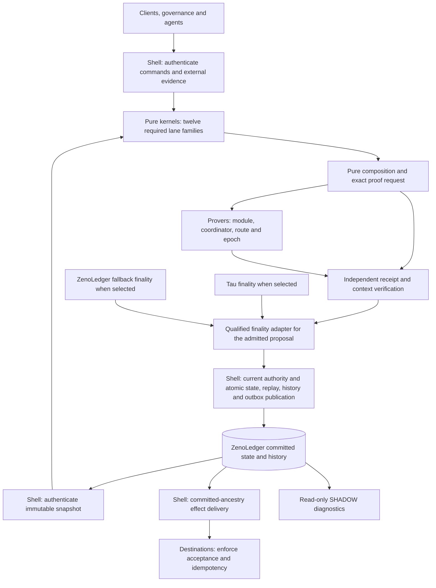
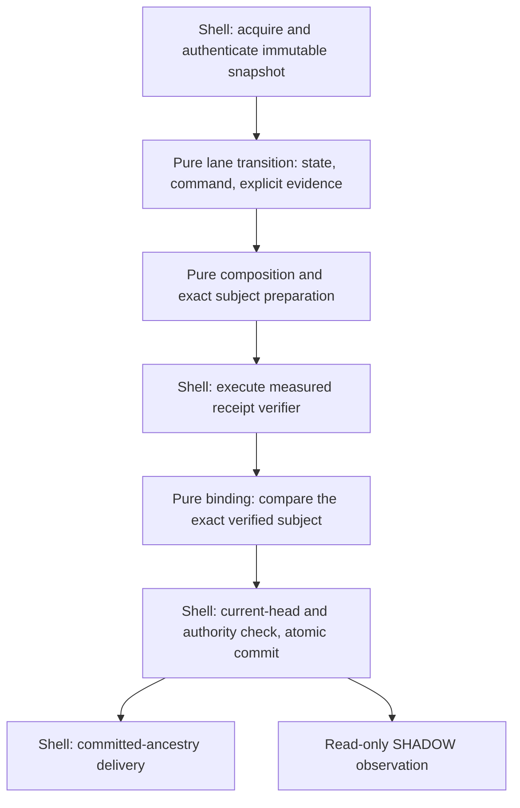

# Resource roles and functional-core boundaries

The original design assessment used integration subject
`f68171a9922fcaac06dde2bfe22a37e3e94810ae` and the separately checked
`AssetTransferGlobalStateClosureV1` increment. The module receipt boundary
implementation below builds on `705f4a2f2444e5ee42a3c4a3aa5e1ffbf15948eb`.
The subsequent coordinator/route extraction and shared-height epoch proof build on
`2894407d89f29a5ab0f9c6dc632e3847dfd72b72`.
The root-epoch/initial-state extraction and ordered trace-to-table proof build on
`05e897256ef373c81a7f5954fd2a75cc7e01848e`.
These advance the [V3 plan](../ZENODEX_COMPLETION_PLAN.md) without changing
runtime economics, canonical bytes, policy constants, release images or
publication authority.

## Architecture decision

Keep the existing lane kernels and canonical ledger tables. Make each economic
transition own its complete result, derive its state/effect views, and compose
them through explicit contracts. Keep independent checking where proposed data
crosses a trust boundary. A replacement resource ledger or a generic universal
transition engine is not required for this improvement.

Resource roles describe different obligations in the existing types:

| Role | Meaning and invariant owner |
| --- | --- |
| Holdings | Actual ledger amounts in balances, custody and reserves. The global accounting relation checks their supply coverage and exact movement. |
| Claims | Entitlements against holdings in the corresponding asset and custody domain. The backing relation checks these separately from holdings. |
| Obligations | Outstanding duties and terminal disposition, with explicit owner, lifecycle and effect ancestry. A conserved state may still contain an unfulfillable obligation. |
| Command authority | Evidence that this actor may request this command under its pinned policy, context and replay scope. Conservation does not establish it. |
| Receipt evidence | Cryptographic execution evidence for exact guest, journal and receipt bytes. It supplies neither a current store head nor writer authority. |
| Publication authority | Store-current authorization to commit the checked transition at one linearization point, with replay, history, receipt and required outbox. |

For example, 5 atoms in an account plus 10 atoms in custody are 15 held atoms.
A 6-atom claim backed by that custody is an entitlement to part of those 15.
Adding the claim to holdings would double-count the backing tokens. The custody
transfer's physical view counts balances plus custody; the global owned view
also counts reserves. These are derived views with different contracts.

## Economics, recursive proofs and finality

The accepted architecture separates three responsibilities:

- The functional core defines authorized economic transitions. ZenoLedger owns
  their canonical economic state, ordering and atomic publication.
- ZRPF, also called ZKRPF in the design discussion, scales verification through
  recursive execution proofs. It must preserve the exact economic statement and
  context. Proof checks required by the selected release remain mandatory.
- A qualified finality adapter establishes which admitted history is final.
  Tau is preferred when compatible and available; independent ZenoLedger
  finality supplies the fallback. Another chain may supply a qualified adapter
  without becoming an independent economic writer.

Fund and value-movement safety is the acceptance requirement across these
choices: each effective movement must follow the pinned authorization and
accounting rules, preserve backing and terminal obligations, consume replay
state exactly once, and retain committed ancestry. A finality certificate
cannot authorize an economically invalid transition. An execution proof cannot
choose between competing histories. Neither alone permits an external effect.

Provider changes must preserve one continuous economic history. Fallback
authorization must remain usable without Tau permission when Tau is unavailable
or changes incompatibly. Rejoin requires compatible rules and authenticated
catch-up to the current checkpoint, with old writer authority excluded. Local
timeout observations alone do not establish a safe handoff. Progress still
depends on the fallback's declared network, participant and data-availability
assumptions. Finalizing ZenoLedger state does not release assets locked on an
unavailable external chain.

The current [M6 transition](../../src/core/m6_safe_mount_transition_v1.py) already
models `FALLBACK_ACTIVATE` and `TAU_REJOIN` with checkpoint and authority-epoch
binding. Its closed finality modes currently cover Tau and fallback only. The
[finality port](../../src/integration/m6_commit_port_v1.py) requires independent
verification bound to the exact proposal and rejects publication without its
verifier. These interfaces do not establish a deployed finality protocol,
qualified failover or support for an arbitrary new chain. Each adapter still
needs evidence for its exact verification rules, finality assumptions, data
availability, handoff and destination enforcement. Scaling and adapter changes
must retain those obligations.

## Whole-program map and specification index

This is the target architecture. The implementation assessment below records
which restricted paths have evidence and which obligations remain open. The
diagram does not certify that all twelve lane families or finality adapters are
implemented, mounted or qualified. Every node and arrow describes a required
responsibility or data flow; solid arrows confer no implementation status.



The two finality providers are alternatives selected through an authorized
handoff over one history. Provers and publishers may propose outputs; the
acceptance checks and destination enforcement must retain independent authority.
That requirement still needs deployment qualification. Authenticated state
availability and historical verification remain necessary for recovery.
Finality verification and the complete delivery/reconciliation path remain
unqualified as a deployed system.

The specification is currently distributed across these documents:

| Document | Scope and limit |
| --- | --- |
| [Completion plan](../ZENODEX_COMPLETION_PLAN.md) and [V3 work graph](ZENODEX_WHOLE_PROGRAM_PLAN_V3.json) | Whole-program requirements, dependencies and acceptance criteria. Task declarations do not establish completion. |
| [Global functional-core blueprint](ZENODEX_GLOBAL_FUNCTIONAL_CORE_FORMAL_BLUEPRINT_V1.md) | A source-pinned bounded model and its formal assumptions. It does not cover every lane lifecycle or prove the runtime. |
| [Settlement ABI reference](GLOBAL_SETTLEMENT_ABI_V1_REFERENCE_20260805.md) | Typed state, effects, receipt and publication boundaries, with versioned compatibility requirements. |
| [Authority and effect map](ZENODEX_WHOLE_PROGRAM_V3_AUTHORITY_DISCOVERY.md) | Source-specific command, writer, finality and delivery inventories, including unmounted consumers and unresolved deployment coverage. |
| [Value-movement closure status](ZENODEX_VALUE_MOVEMENT_CLOSURE_STATUS_V1.json) | Subject-specific retained obligations and evidence. Historical observations must be refreshed before assessing a later release. |

A complete architecture specification still requires the remaining lane,
cross-lane, refinement and operational contracts to close together on one
release subject. Neither formal functional-core completion nor whole-program
FCIS completion follows from this map.

## Intended phase boundaries



Each boundary should reuse the existing narrowly typed values. Preparation
produces a request and grants no receipt authority. Verification must establish
the exact request subject. Binding cannot accept a caller-supplied success flag.
Publication rechecks the current head and writer capability even when earlier
mathematical and cryptographic checks succeeded. Python private constructors
are API discipline within a trusted process, not protection from arbitrary code
execution in that process.

The shell may acquire consensus inputs and choose a configured implementation.
It must not independently reconstruct fees, balances, allocation ownership or
command semantics already determined by the core. An exact retry and a lost
response after commit retain their distinct outcomes. SHADOW failures remain
outside economic commitments and decisions.

## Current implementation assessment

The restricted custody path already has separate transition, projection,
allocation, receipt admission and publication components:

- [Custody transition](../../src/core/asset_transfer_lane_module_custody_v1.py)
  owns the custody-complete physical totals and their dependent commitments.
- [Global projector](../../src/core/global_economic_effect_projector_v1.py)
  constructs proposed table and metadata changes. The
  [state/effect refinement checker](../../src/core/global_economic_state_effect_refinement_v1.py)
  independently checks supplied state/effect consistency.
- [Receipt admission](../../src/core/asset_transfer_receipt_admission_v1.py)
  derives controlled custody and claimant rows;
  [allocation projection](../../src/core/global_accounting_allocation_projection_v1.py)
  checks their complete partition and backing.
- The [isolated receipt pipeline](../../src/integration/isolated_asset_receipt_pipeline_v1.py)
  selects the versioned custody transition and binds module, coordinator and
  route receipts.
- The [durable publisher](../../src/integration/global_economic_durable_publisher_v1.py)
  acquires the committed source, rejects a mismatched proposed predecessor,
  verifies a publisher-bound epoch, and submits its bundle to the
  [journal](../../src/integration/global_economic_epoch_journal_v1.py) for CAS.
  Its bundle construction is publication binding; this inspection found no
  independent fee calculation there.

[Lane module verification](../../src/core/lane_module_receipt_verification_v1.py)
now separates four pure `prepare_*` entry points from final binding. Preparation
retains the existing snapshots, ordered guards and transition recomputations.
Its owned request includes profile, lane, module release, image and exact
receipt/journal bytes, alongside the unchanged nine final witness fields.

The [integration wrappers](../../src/integration/lane_module_receipt_verification_v1.py)
accept the exact factory-controlled
[isolated role port](../../src/integration/isolated_profile_receipt_ports_v1.py).
That port snapshots the preparation before verifier I/O, checks its module
role and profile/lane/release, executes the retained verifier, and checks its
authority and exact `None` success outcome before issuing internal execution
evidence. The pure binder requires complete subject equality, matching verifier
identity and matching content digests before its sole final witness mint.
Copying the preparation before I/O prevents a retained caller alias from
relabeling the subject whose bytes were verified.

The four effectful Python `verify_*` APIs moved from `src.core` to the new
integration module. Their candidate and final witness formats remain unchanged;
the shell requires a measured isolated port. There is no core-to-shell import or
effectful compatibility wrapper. Existing unit callback scenarios explicitly
use a [synthetic evidence helper](../../tests/core/lane_module_receipt_fixtures_v1.py)
that supplies no cryptographic or deployment evidence. This is a deliberate
Python API migration, with historical wire decoding preserved.

Strict FCIS for the complete dependency path is still open. The earlier
independent Daybreak review identified
`BoundEconomicReceiptVerifierV1._verify_exact_receipt` in
[verifier deployment binding](../../src/core/economic_receipt_verifier_deployment_v1.py),
which still executes a backend and uses a core-layer authority registry.
The root-epoch and initial-state execution paths are now separated below.
Tokenomics, fee and buyback receipt paths still retain other effectful callbacks;
the completed extractions do not close those separate effect owners.
An independent Terra review checked the new shell source; root reviewed the
pure-core implementation and the preserved scenario bodies. The attempted
additional Daybreak review could not start because the agent thread limit was
reached; it supplied no new verdict.

The new [module boundary cases](../../tests/integration/test_lane_module_receipt_boundary_v1.py)
exercise factory role and context rejection, exact subject and verifier
substitution, byte/digest pairing, retained alias changes, backend failure,
deterministic binding and a snapshot-omission mutant. Their process replies are
explicitly synthetic. They qualify neither genuine RISC0 receipts nor a
deployment. The existing candidate/final-witness owner remains together in one
module; the extracted phases use small functions without introducing another
wire schema or publication authority.

The admission inventory also exposed an earlier permissive result check in
[`_admit_global_fragment_v1`](../../src/core/asset_transfer_receipt_admission_v1.py).
The lift now consumes an exact allocation witness, propagates its two exact
closed rejection types, and raises `TypeError` for other results before reading
fragment data. A retained regression observes that refusal and unchanged
economic inputs. The reviewed custody module joins the scanned inventory;
existing guard pins are retained, and newly introduced exact-type guards are
listed explicitly. These checks detect source drift and internal contract
violations under the trusted-interpreter premise.

The current implementation evidence is declared separately in
[the module receipt packet](../../tests/evidence/test_hygiene/THV1-20260907-module-receipt-boundary-v1.json).
Its source-pinned test files cover the four receipt families, measured role
ports, global allocation admission and isolated publication outcomes. Replay
that declared file set with:

```bash
python3 -B - <<'PY'
import subprocess
import sys
from experiments.v3_module_receipt_boundary_v1.render_evidence import TESTS
subprocess.run([sys.executable, "-B", "-m", "pytest", "-q", "-p", "no:cacheprovider", *TESTS], check=True)
PY
```

Render the declaration with
`python3 -B -m experiments.v3_module_receipt_boundary_v1.render_evidence`.
Rendering does not execute the tests. Earlier proof packets retain their
historical source pins; no Lean, Rust or guest source changes in this increment.
The allocation golden is regenerated with
`python3 -B tools/render_asset_transfer_global_allocation_v1_golden.py`;
comparison with the retained fixture found only the reviewed Python admission
source hash changed, with every economic vector unchanged.
The epoch-position golden uses
`python3 -B tools/render_asset_transfer_epoch_position_v1_golden.py` and has the
same metadata-only change. The 19-file run had 553 passing tests and this one
stale-pin failure; the full epoch-position file and the allocation golden check
passed after regeneration. No runtime or test source changed after that run.

### Coordinator and route receipt phases

The [coordinator core](../../src/core/lane_composition_receipt_verification_v1.py)
and [route core](../../src/core/route_composition_receipt_verification_v1.py)
use the same preparation, measured execution and pure binding boundary. Asset
and perps-margin coordinator preparation retain the old candidate checks;
route preparation retains exact ordered lane pairing and the existing 1–8 lane
bound. Each prepared subject owns all twelve final witness fields and the exact
receipt and journal bytes. Role-port coordinates derive from those fields.
The existing witness identities and canonical encodings remain unchanged.

The shell admits the corresponding factory-controlled coordinator or route
port, detaches the preparation before I/O, and retains its callable, profile,
role, release, lane and measured verifier identity across the call. Changed
authority or a backend return other than exact `None` prevents execution
evidence. The pure binder checks the complete subject, verifier identity and
content digests before minting the final witness. Existing module port methods
are unchanged; the isolated pipeline's migration changes its imports.

The [composition boundary tests](../../tests/integration/test_receipt_composition_boundary_v1.py)
cover successful asset, perps-margin and route binding; wrong role or context
before I/O; substitution of each final field and both byte fields; consistent
changed bytes and digests; changed aliases and retained authority; backend
failure; and exact deterministic re-binding. Snapshot-omission mutants execute
the altered method and show the ordinary alias law rejecting its behavior.
These tests use explicitly simulated RISC0 process replies. Test-only callback
helpers serve the existing unit scenarios and grant no production authority.

The extraction preserves the domains of computed hashes as well as their
ordinary values. A SHA-256 output does not establish a nonzero value. A new
preparation guard may require nonzero only when the earlier admission already
establishes it; stricter later-consumer rules retain their original location.
Synthetic hash-function substitution checks this boundary without claiming a
hash preimage or a genuine receipt.

The new [composition packet](../../tests/evidence/test_hygiene/THV1-20260907-composition-receipt-boundary-v1.json)
declares the exact affected subject. Render it with
`python3 -B -m experiments.v3_composition_receipt_boundary_v1.render_evidence`.
Rendering executes no tests and grants no authority. The earlier module packet
keeps its historical source pins. Whole-path FCIS, genuine recursive receipt
qualification and deployment mediation remain separate open obligations.

### Shared-height epoch state continuation

[AssetTransferEpochStateClosureV1](../../lean-mathlib/Proofs/AssetTransferEpochStateClosureV1.lean)
proves the restricted custody transfer's continuation within an epoch. The first
command advances source height `H` to `H + 1`; later commands retain that shared
height while carrying forward their actual economic result and replay insertion.
The construction changes the existing four metadata fields and derives the nine
inherited state obligations. Rejection retains the exact carried state, an empty
plan and no occurrence. Its admitted prefix derives the carried state, context
and replay fold, with length `0..64` and a separate nonempty `1..64` corollary.

The proof leaves the standalone `Verified` relation intact. Its adjacent-height
rule applies at the first position. Later positions use an explicit
`SharedHeightVerified` bundle retaining the accounting, backing, effect, terminal
and quantity obligations with the shared-height replay rule. The direct height
proof also covers two commands whose target is the maximum u64 height.
It requires input admission and the initial state invariant; no desired output
invariant or preservation oracle is assumed.

The [focused formal test](../../tests/formal/test_lean_asset_transfer_epoch_state_closure_v1.py)
freshly compiles the Std-only Lean 4.27 closure, consumes all 27 theorem
signatures, checks permitted axioms and source pins, compares two transfers over
nonempty custody/backed liabilities with the actual epoch-position relation,
and checks rejection and maximum-height cases. Separate aggregate-checker
controls use the legacy empty-custody fixture. Two controlled constructor mutants
produce incorrect height/replay observations and fail the corresponding proof
obligations. The full focused file passed independently after review:

```bash
python3 -B -m pytest -q -p no:cacheprovider tests/formal/test_lean_asset_transfer_epoch_state_closure_v1.py
```

This theorem is restricted to one enabled asset lane with empty reserves,
terminal registry and outbox. Lean treats roots and identities as opaque values.
The second Python prospective state is an explicit test builder checked by the
actual epoch relation; finite observation agreement is not universal runtime
refinement. The next theorem below connects this state trace to checked table
aggregation. Aggregate authorization, authentic source and receipt origin, and
atomic publication remain open. The proof is registered in
`Proofs.lean`; the complete Mathlib build and native guest proving were not run.
Render its separate declaration with
`python3 -B -m experiments.v3_transfer_epoch_state_closure_v1.render_evidence`.

The lack of a qualified custody guest, universal runtime refinement and
deployment evidence are separate assurance gaps. They do not by themselves
demonstrate an FCIS violation. The stale custody-wrapper header also cannot be
used to conclude that receipt admission is absent: the isolated pipeline already
selects it. The native
[custody preparation crate](../../zk/asset_transfer_custody_module_risc0/README.md)
explicitly lacks a qualified RISC0 guest, measured image and genuine receipt.

### Ordered transfer traces and economic tables

[AssetTransferEpochEconomicTablesV1](../../lean-mathlib/Proofs/AssetTransferEpochEconomicTablesV1.lean)
retains the actual input list in an accepted trace and maps those inputs to their
custody-complete plans in command order. From the certified source and each
input's existing admission requirements, it derives the adjacent four-table
relations and their composed `TableChain`. It also derives unique endpoint keys
from the admitted states. No desired post-state, plan or table equation is an
input premise of this derivation.

The checked fold succeeds with every endpoint equation exactly when its ordered
signed prefixes fit. A successful i128 fold then yields canonical balances,
custody, liability and reserve delta tuples. `PrefixFits` remains explicit;
representable final balances alone do not imply it. The canonical-row
corollaries explicitly assume the actual checked fold succeeded.

The [formal tests](../../tests/formal/test_lean_asset_transfer_epoch_economic_tables_v1.py)
compile a fresh 23-module Std-only Lean 4.27 closure and consume all 19 theorem
signatures with standard axiom checks. The same concrete two-transfer inputs
drive the Lean trace, actual Python custody transition and coordinator, the
epoch-position relation, composer and four-table checker at source heights 7
and `MAX_U64 - 1`. Plan-order and omission mutants produce different ordered
observations and fail the ordinary append theorem. The
[runtime tests](../../tests/core/test_asset_transfer_epoch_economic_tables_v1.py)
also exercise wrong owner/domain/table rows, disconnected history, actual
unique-occurrence chains at arities 0, 1, 64 and 65, and four valid leaves whose
intermediate signed totals overflow despite final cancellation. The last case
uses an allowed synthetic zero-fee parameter and selects no deployed policy.

```bash
python3 -B -m pytest -q -p no:cacheprovider tests/core/test_asset_transfer_epoch_economic_tables_v1.py tests/formal/test_lean_asset_transfer_epoch_economic_tables_v1.py
python3 -B -m experiments.v3_transfer_epoch_economic_tables_v1.render_evidence
```

The two files passed 10 focused tests in a fresh replay. This is a restricted
trace-to-table theorem with finite runtime correspondence. It establishes no
aggregate `Verified` record, authorization, authentic roots, universal
Python/Rust refinement or publication. The isolated pipeline and durable
publisher still require one occurrence. Full Mathlib and native guest builds
were not run.

### Pure runtime construction for a transfer epoch

The [Python epoch projector](../../src/core/asset_transfer_epoch_projection_v1.py)
and its [Rust ABI counterpart](../../zk/global_settlement_abi_v1/src/asset_transfer_epoch_projection.rs)
construct ordinary prospective state from four explicit inputs: epoch source
and position, predecessor, command occurrence, and accepted custody-module
output. They perform no receipt verification, store access or publication.
Each result owns its inputs and derives its post-state during construction;
callers cannot supply a separate post-state to that constructor.

Both implementations set the occurrence height, replace the asset lane root,
copy the private post balances and supplies, and insert the canonical replay
row. They preserve every other predecessor field, including physical custody,
claimant liabilities, reserves, oracle rows, terminal obligations, history and
outbox. Subsequent transfers retain the epoch height and consume the preceding
result. The existing epoch allocation relation separately checks the source,
position, occurrence, private projection and complete-state continuity.

The [formal runtime fixture](../../tests/formal/test_lean_asset_transfer_epoch_economic_tables_v1.py)
now uses this Python constructor for both transfers, including construction of
the second command from the first result. The Lean theorem statements remain
unchanged. A new [reproducible corpus](../../tools/render_asset_transfer_epoch_projection_v1_golden.py)
compares complete states against the independently constructed predecessor test
fixture, then supplies canonical bytes, roots and fixed allocation outcomes to
the [Rust tests](../../zk/global_settlement_abi_v1/tests/asset_transfer_epoch_projection.rs).
It includes four accepted examples and seven rejected examples. A populated
reserve/terminal/outbox case checks frame preservation; its unchanged command
root intentionally prevents admission.

Construction has a narrower error contract than public operation admission.
Duplicate replay or occurrence identities and an exhausted replay table fail
structural construction with Python `ValueError` or Rust `AbiErrorV1` before a
candidate reaches the allocation relation. Malformed typed inputs also reject
at construction. A consuming operation must establish the required preconditions
or translate exact construction failures into deterministic typed operation
rejection. The epoch admission integration below establishes those preconditions
through its existing complete allocation relation; other consumers retain this
obligation.

```bash
python3 -B -m pytest -q -p no:cacheprovider tests/core/test_asset_transfer_epoch_projection_v1.py tests/formal/test_lean_asset_transfer_epoch_economic_tables_v1.py
python3 -B tools/render_asset_transfer_epoch_projection_v1_golden.py --check
cargo test --offline --locked --manifest-path zk/global_settlement_abi_v1/Cargo.toml --test asset_transfer_epoch_projection --test asset_transfer_epoch_position
```

These are internal proposal constructors and bounded correspondence checks.
They do not establish authenticated source acquisition, universal Python/Rust
refinement, aggregate receipt acceptance, a custody guest, a mounted multi-command
epoch, or production value safety. The exactly-one isolated publication policy
is unchanged. Historical evidence packets retain their original subjects.

### Consumed projection at epoch admission

Building on `8b4554dd05bf3f1259473270d35b96d3893283a9`, the
[Python receipt admission](../../src/core/asset_transfer_receipt_admission_v1.py)
and [Rust counterpart](../../zk/global_settlement_abi_v1/src/asset_transfer_receipt_admission.rs)
now run the existing complete epoch allocation relation, construct the owned
runtime projection, require its entire post-state to equal the submitted
current state, and pass the derived values to fragment admission. The existing
rejection family and order remain unchanged.

Successful replay continuity requires two fresh identities and exactly one
canonical row added to the predecessor. The submitted post-state already obeys
the 4096-row schema limit, so successful continuity establishes room for that
insertion. Failed continuity rejects before the constructor runs. The complete
post-state comparison additionally protects the admission boundary against
projection implementation drift. This is a reviewed guard implication with
bounded runtime evidence; no new universal implementation theorem is claimed.

The [core controls](../../tests/core/test_asset_transfer_epoch_projection_admission_v1.py)
cover first and second positions, ownership, full-table rejection and a changed
derived history root. The
[isolated publication history](../../tests/integration/test_asset_transfer_epoch_projection_publication_v1.py)
commits a custody-backed transfer, reopens the ledger, rejects its reused nonce,
and commits a subsequent fresh command through the same pipeline. Rejection
preserves the logical ledger and head. Exact retries reverify the submission
while retaining the original committed record. The 4096-row capacity control
is core evidence; this publisher history does not execute 4096 committed epochs.

Module, coordinator and route receipt verification precede allocation admission.
The no-effect observation covers fragment minting, later root receipt
verification and economic publication after the allocation rejection. It does
not imply zero verifier work or unchanged physical database files. Signatures
use real BLS; receipt processes and release coordinates remain synthetic.

The successor [evidence declaration](../../tests/evidence/test_hygiene/THV1-20260907-transfer-epoch-projection-admission-v1.json)
pins this consumer and the unchanged Lean theorem signatures. Its renderer only
records the subject; Python/Lean and native Rust replay run separately:

```bash
python3 -B -m experiments.v3_transfer_epoch_projection_admission_v1.render_evidence
python3 -B -m pytest -q tests/core/test_asset_transfer_epoch_projection_admission_v1.py tests/integration/test_asset_transfer_epoch_projection_publication_v1.py
cargo test --offline --locked --manifest-path zk/global_settlement_abi_v1/Cargo.toml --test asset_transfer_epoch_projection_admission --test asset_transfer_epoch_projection --test asset_transfer_epoch_position
```

The generic constructor retains its structural-error contract. The isolated
mount still supports one occurrence. No publisher implementation, wire field,
policy, guest image ID or live authority changes. Selected Rust consumers still
require rebuild and release-specific qualification; these tests do not provide
a real custody proof or remove runtime, process and host assumptions.

### Root-epoch and initial-state receipt execution

The [core epoch module](../../src/core/global_economic_proof_v1.py) now prepares
the complete immutable epoch subject without invoking a receipt verifier. The
[integration module](../../src/integration/global_economic_epoch_verification_v1.py)
owns the verifier protocol, callback execution, final handle and process-local
authority registry. It detaches the prepared fields before I/O and mints the
handle from the executed copy. Publisher binding still requires the exact
publisher token and verifier object; a matching string or Boolean supplies no
such binding.

[Initial-state preparation](../../src/core/economic_initial_state_publisher_verification_v1.py)
retains the complete owned genesis/migration admission, including the policy
registry, source manifest and predecessor. Its shell executes the exact receipt,
image and regenerated journal before returning the existing internal result.
Preparation markers and exact types prevent ordinary unconstructed or
substituted values from crossing these boundaries. They assume an intact Python
process and confer no independent store or publication authority.

The [boundary tests](../../tests/integration/test_economic_epoch_verifier_boundary_v1.py)
cover exact requests, first rejection before I/O, alias changes, prepared-value
substitution, publisher identity, verifier exceptions, retries and durable
publisher observations. The generic reference callback retains its historical
return-value semantics; the measured Bound verifier separately requires exact
`None`. The two publisher bodies are preserved apart from imports. Wire values,
root domains and economic rules are unchanged.

```bash
python3 -B -m pytest -q -p no:cacheprovider tests/integration/test_economic_epoch_verifier_boundary_v1.py
python3 -B -m experiments.v3_epoch_receipt_boundary_v1.render_evidence
```

These tests use synthetic receipts and verifier behavior. They qualify no real
proof, deployed verifier, finality adapter or production release. Bound-verifier
deployment and the remaining tokenomics callbacks are separate FCIS obligations.

## Publisher-host compromise and independent enforcement

The current isolated publisher assumes a trusted interpreter and operating
system. Its private witnesses, measured verifier process and local database
checks support that bounded contract. A deployment requirement to survive a
compromised publisher host needs enforcement outside that host. This review
does not establish such a deployment or demonstrate an exploitable live path.

Independent Fable 5.1 and Daybreak reviews inspected the publisher, journal,
authority, anchor and delivery boundaries. Root checked their conclusions
against the integration subject and retained these distinctions:

- The journal's `_decode_source_state_v1` reconstructs the complete typed state
  and compares its computed `state_root` with the retained head. Root rejected
  the suggested missing root check. Hash consistency still does not establish
  authentic history: `_publication_source_for_verified_publisher_v1` explicitly
  relies on verified creation and trusted store integrity instead of replaying
  stored cryptographic receipts.
- The verifier adapter pins and seals executable bytes. Its `_invoke_v1` does
  not select a different UID or provide a store-access sandbox. Passing no
  database descriptor does not establish that the child cannot open a path
  accessible to its inherited identity. Same-host arbitrary execution remains
  outside the stated protection.
- The [monotonic anchor](../../src/integration/global_economic_monotonic_anchor_v1.py)
  is an explicitly SHADOW-only integration. It records heads through a backend
  whose authentication and consistency require separate evidence. Its
  after-commit update cannot establish independent transition validity.
- The [M6 commit port](../../src/integration/m6_commit_port_v1.py) and
  [delivery adapter](../../src/integration/m6_outbox_delivery_v1.py) are a
  separate reference path. The ordinary restricted asset epoch forbids external
  outbox rows. This review found no qualified destination consumer for ordinary
  economic epochs. Missing snapshot files alone were not treated as absent code.

The target boundary for publisher-host compromise resistance is:

```text
Untrusted proposal and proof generation
  -> independent exact-state, authorization and receipt validation
  -> one ZenoLedger economic history with qualified adapter finality
  -> destination-enforced finality, ancestry and idempotency
```

Independent validation must bind the complete canonical subject, pinned release
and policy, authenticated predecessor, command authority, allocation and replay
state. A receipt alone establishes neither current-head selection nor finality.
Destinations must verify the applicable authenticated commitment before effects;
an unchecked publisher success message is insufficient. Data availability,
withdrawal/recovery paths and validator membership transitions remain separate
obligations. Existing ZenoLedger authority must be qualified rather than replaced
with an unreviewed consensus protocol.

An interim containment step can use distinct OS identities for proposal,
verification and publication, plus independently validated exports of committed
bundles. This requires a narrow provisioned launcher or broker and actual
permission checks; it does not justify granting the application broad privilege
switching authority. Read validation should consume owned exports without
loosening the live store's owner checks. During SHADOW, missing exports, verifier
failure and disagreements remain visible observational gaps and cannot change
economic commitments or decisions. Same-host isolation still trusts the kernel,
privileged administration and configuration.

Validator independence must be assessed by administrative and infrastructure
failure domains: operators, credentials, cloud control planes, regions,
networks, signing services, client implementations and update pipelines.
Multiple VMs on one host or machines under one cloud account share important
failure modes. Replica counts alone do not quantify compromise probability.

Root corrected the review's proposed universal 5-of-7 policy. For a fixed,
equal-weight validator set, intersecting certificates avoid a wholly faulty
intersection when `2q - n > f`, provided honest validators obey the required
non-conflict rules. `q <= n - f` only permits a quorum without faulty members;
it does not prove liveness, locking or view-change correctness. The existing
[M6 structural certificate](../../src/core/m6_safe_mount_types_v1.py) leaves
cryptography, availability and fault assumptions to external qualification.
Its constants cannot silently select policy for ordinary economic publication.

Required future evidence includes independent validation of exported histories,
complete or explicitly missing ancestry, source-bound receipt rejection, exact
destination binding, writer revocation across restart, and recovery under
declared partition and correlated-failure bounds. The reviews supplied no
executable security evidence. No privilege, quorum, destination, deployment or
authority change is implemented by this assessment.

## State continuity without another ledger abstraction

[AssetTransferGlobalStateClosureV1](../../lean-mathlib/Proofs/AssetTransferGlobalStateClosureV1.lean)
uses the actual custody module state and the actual global step to construct one
continued `State`. It retains policies and release identity while carrying the
new height, lane root and replay registry. Its central theorem proves:

```text
Admitted(input) -> StateInvariant(continuedState(input))
```

The invariant contains nine inherited state obligations: module-state admission,
quantity bounds, owned-supply equality, claimant backing, empty reserves,
terminal registry and outbox, one enabled lane, and release agreement.
Both actual verdicts are covered. Accepted transfers obtain these obligations
from the constructive successor theorem; rejected leaves retain the exact pre.

Continuation still requires ten new input facts: exact predecessor identity,
occurrence context, adjacent height, capacity for that height, fresh replay key,
fresh occurrence identity, pre-lane-root agreement, changed post lane root,
well-formed command and fee eligibility. Together with the inherited invariant
these construct the next `Admitted` proof. No desired output state is a premise.

This distinction matters at maximum height. A valid state at `maxU64` remains
safe under the invariant, but it cannot supply capacity for another increment.
State preservation establishes safety, not indefinite progress. Roots remain
opaque mathematical inputs, as in the unchanged predecessor theorem.

## Review method, falsifiers and remaining work

The architecture comparison uses ShapeForge's typed world-model and one-axis
scenario method, based on the existing promoted seed artifacts. No ShapeForge
MCP run, design-optimality certificate or promoted seed change is claimed.
Independent reviewers are advisory; Lean and executable tests own acceptance.

A bounded Opus 5 review independently mapped the four module/coordinator/route/
epoch verifier callbacks and confirmed the importance of existing rejection
order. Root rejected its claim that an injected callback returning `None` makes
the caller pure: that callback can execute I/O and fail with transport errors.
Root also declined a request-only witness-mint helper, which would not consume
evidence of verification. No runtime patch or equivalence claim follows from
that review. A differential corpus can falsify equivalence and support bounded
cases; universal refinement remains a separate obligation.

Refactors are inadmissible if they allow substituted post tables, omitted assets,
claims counted as holdings, same-supply unauthorized movement, replay consumed
on rejection, lost global metadata, or one root domain substituted for another.
A shared unproved producer/checker fold could create common-mode errors and is
not accepted as a simplification here. Ordered width checks and independent
complete-key checks must remain.

The [state-closure evidence packet](../../tests/evidence/test_hygiene/THV1-20260906-transfer-global-state-closure-v1.json)
records the replay scope, mutation and exact source pins. The fresh-source
consumer suite passed all five tests on 2026-09-06:

```bash
python3 -B -m pytest -q -p no:cacheprovider tests/formal/test_lean_asset_transfer_global_state_closure_v1.py
python3 tools/scan_lean_proof_placeholders_v1.py --json lean-mathlib/Proofs/AssetTransferGlobalStateClosureV1.lean
python3 -m ruff check tests/formal/test_lean_asset_transfer_global_state_closure_v1.py experiments/v3_transfer_global_state_closure_v1/render_evidence.py
python3 -m mypy --follow-imports=silent tests/formal/test_lean_asset_transfer_global_state_closure_v1.py experiments/v3_transfer_global_state_closure_v1/render_evidence.py
```

The placeholder scan found zero matches; focused lint and type checks passed.
The suite compiles a fresh Std-only Lean 4.27 dependency closure, checks public
theorem signatures and permitted axioms, compares two actual runtime transfers,
refutes invalid continuation requirements and kills a metadata-loss mutant.
The second acceptance consumer proves its carried balance normalization before
kernel reduction; it does not substitute an assumed safe predecessor.

Regenerate the declared evidence with
`python3 -B -m experiments.v3_transfer_global_state_closure_v1.render_evidence`.
Rendering performs no proof or test. Full Lake, Cargo/RISC0, solver and
production qualification gates were not run for this increment.

This evidence does not establish generic
runtime traces, canonical encoding/hash refinement, authenticated snapshots,
receipt validity or publication safety. Full lane lifecycles, cross-lane
composition, resource ceilings, recovery, historical verification and
deployment-complete mediation remain V3 obligations. The formal functional core
and the whole plan are still incomplete.
