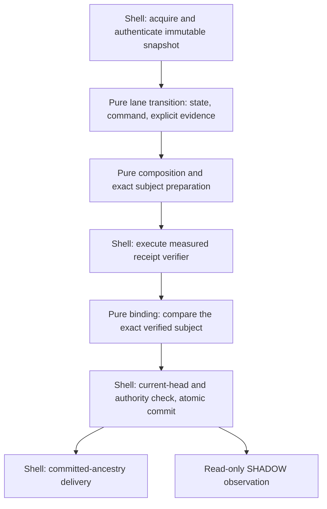

# Resource roles and functional-core boundaries

This design assessment uses integration subject
`f68171a9922fcaac06dde2bfe22a37e3e94810ae` and the separately checked
`AssetTransferGlobalStateClosureV1` increment. It advances W02/W09 of the
[V3 plan](../ZENODEX_COMPLETION_PLAN.md). It changes no runtime economics,
canonical bytes, policy constants, release images or publication authority.

## Architecture decision

Keep the existing lane kernels and canonical ledger tables. Make each economic
transition own its complete result, derive its state/effect views, and compose
them through explicit contracts. Keep independent checking where proposed data
crosses a trust boundary. A replacement resource ledger or a generic universal
transition engine is not required for this improvement.

Resource roles describe different obligations in the existing types:

| Role | Meaning and invariant owner |
| --- | --- |
| Holdings | Actual ledger amounts in balances, custody and reserves. The global accounting relation checks their supply coverage and exact movement. |
| Claims | Entitlements against holdings in the corresponding asset and custody domain. The backing relation checks these separately from holdings. |
| Obligations | Outstanding duties and terminal disposition, with explicit owner, lifecycle and effect ancestry. A conserved state may still contain an unfulfillable obligation. |
| Command authority | Evidence that this actor may request this command under its pinned policy, context and replay scope. Conservation does not establish it. |
| Receipt evidence | Cryptographic execution evidence for exact guest, journal and receipt bytes. It supplies neither a current store head nor writer authority. |
| Publication authority | Store-current authorization to commit the checked transition at one linearization point, with replay, history, receipt and required outbox. |

For example, 5 atoms in an account plus 10 atoms in custody are 15 held atoms.
A 6-atom claim backed by that custody is an entitlement to part of those 15.
Adding the claim to holdings would double-count the backing tokens. The custody
transfer's physical view counts balances plus custody; the global owned view
also counts reserves. These are derived views with different contracts.

## Intended phase boundaries



Each boundary should reuse the existing narrowly typed values. Preparation
produces a request and grants no receipt authority. Verification must establish
the exact request subject. Binding cannot accept a caller-supplied success flag.
Publication rechecks the current head and writer capability even when earlier
mathematical and cryptographic checks succeeded. Python private constructors
are API discipline within a trusted process, not protection from arbitrary code
execution in that process.

The shell may acquire consensus inputs and choose a configured implementation.
It must not independently reconstruct fees, balances, allocation ownership or
command semantics already determined by the core. An exact retry and a lost
response after commit retain their distinct outcomes. SHADOW failures remain
outside economic commitments and decisions.

## Current implementation assessment

The restricted custody path already has separate transition, projection,
allocation, receipt admission and publication components:

- [Custody transition](../../src/core/asset_transfer_lane_module_custody_v1.py)
  owns the custody-complete physical totals and their dependent commitments.
- [Global projector](../../src/core/global_economic_effect_projector_v1.py)
  constructs proposed table and metadata changes. The
  [state/effect refinement checker](../../src/core/global_economic_state_effect_refinement_v1.py)
  independently checks supplied state/effect consistency.
- [Receipt admission](../../src/core/asset_transfer_receipt_admission_v1.py)
  derives controlled custody and claimant rows;
  [allocation projection](../../src/core/global_accounting_allocation_projection_v1.py)
  checks their complete partition and backing.
- The [isolated receipt pipeline](../../src/integration/isolated_asset_receipt_pipeline_v1.py)
  selects the versioned custody transition and binds module, coordinator and
  route receipts.
- The [durable publisher](../../src/integration/global_economic_durable_publisher_v1.py)
  acquires the committed source, rejects a mismatched proposed predecessor,
  verifies a publisher-bound epoch, and submits its bundle to the
  [journal](../../src/integration/global_economic_epoch_journal_v1.py) for CAS.
  Its bundle construction is publication binding; this inspection found no
  independent fee calculation there.

This decomposition is useful, but strict FCIS is not established. In particular,
`_verify_rebound_module_receipt_v1` in
[lane module verification](../../src/core/lane_module_receipt_verification_v1.py)
performs pure structural/release/journal checks and then calls
`receipt_verifier.verify_succinct_receipt`. The configured port can execute a
subprocess through the
[integration verifier](../../src/integration/global_receipt_verifier_v1.py).
The function therefore mixes deterministic preparation and effectful execution
despite living in `src/core`. Similar composition-verifier surfaces require the
same caller-aware review. Moving files alone would not separate those phases.

An independent Daybreak review confirmed this distinction and traced a further
backend call in `BoundEconomicReceiptVerifierV1._verify_exact_receipt` in
[verifier deployment binding](../../src/core/economic_receipt_verifier_deployment_v1.py).
That core-layer function also executes a retained backend. Both effect owners
must be separated before a strict purity claim about this dependency path.

The smallest next runtime refactor should extract exact request preparation,
effectful verification, and subject-bound result construction while retaining
guard precedence, snapshots, receipt limits and all existing witness bindings.
It must preserve historical imports deliberately and avoid introducing a
core-to-shell dependency cycle or a second unchecked witness constructor.
This report specifies that refactor; it does not claim it is implemented.

The existing receipt APIs return `None` on success; no reusable typed execution
attestation was found in the inspected path. A narrow new execution-evidence
value is justified if it binds the complete immutable request and the selected
verifier identity. Only the integration-owned verified role port may construct
production evidence, after successful execution and unchanged identity checks.
The pure final binder must compare the evidence's exact subject with the
prepared request. A generic no-op callback cannot mint that production evidence.
The new attestation should remain internal so the existing nine final witness
fields and wire commitments retain their meanings. Effectful compatibility
wrappers left in `src/core` would preserve the strict FCIS gap.

The lack of a qualified custody guest, universal runtime refinement and
deployment evidence are separate assurance gaps. They do not by themselves
demonstrate an FCIS violation. The stale custody-wrapper header also cannot be
used to conclude that receipt admission is absent: the isolated pipeline already
selects it. The native
[custody preparation crate](../../zk/asset_transfer_custody_module_risc0/README.md)
explicitly lacks a qualified RISC0 guest, measured image and genuine receipt.

## Publisher-host compromise and independent enforcement

The current isolated publisher assumes a trusted interpreter and operating
system. Its private witnesses, measured verifier process and local database
checks support that bounded contract. A deployment requirement to survive a
compromised publisher host needs enforcement outside that host. This review
does not establish such a deployment or demonstrate an exploitable live path.

Independent Fable 5.1 and Daybreak reviews inspected the publisher, journal,
authority, anchor and delivery boundaries. Root checked their conclusions
against the integration subject and retained these distinctions:

- The journal's `_decode_source_state_v1` reconstructs the complete typed state
  and compares its computed `state_root` with the retained head. Root rejected
  the suggested missing root check. Hash consistency still does not establish
  authentic history: `_publication_source_for_verified_publisher_v1` explicitly
  relies on verified creation and trusted store integrity instead of replaying
  stored cryptographic receipts.
- The verifier adapter pins and seals executable bytes. Its `_invoke_v1` does
  not select a different UID or provide a store-access sandbox. Passing no
  database descriptor does not establish that the child cannot open a path
  accessible to its inherited identity. Same-host arbitrary execution remains
  outside the stated protection.
- The [monotonic anchor](../../src/integration/global_economic_monotonic_anchor_v1.py)
  is an explicitly SHADOW-only integration. It records heads through a backend
  whose authentication and consistency require separate evidence. Its
  after-commit update cannot establish independent transition validity.
- The [M6 commit port](../../src/integration/m6_commit_port_v1.py) and
  [delivery adapter](../../src/integration/m6_outbox_delivery_v1.py) are a
  separate reference path. The ordinary restricted asset epoch forbids external
  outbox rows. This review found no qualified destination consumer for ordinary
  economic epochs. Missing snapshot files alone were not treated as absent code.

The target boundary for publisher-host compromise resistance is:

```text
Untrusted proposal and proof generation
  -> independent exact-state, authorization and receipt validation
  -> qualified ZenoLedger ordering and finality
  -> destination-enforced finality, ancestry and idempotency
```

Independent validation must bind the complete canonical subject, pinned release
and policy, authenticated predecessor, command authority, allocation and replay
state. A receipt alone establishes neither current-head selection nor finality.
Destinations must verify the applicable authenticated commitment before effects;
an unchecked publisher success message is insufficient. Data availability,
withdrawal/recovery paths and validator membership transitions remain separate
obligations. Existing ZenoLedger authority must be qualified rather than replaced
with an unreviewed consensus protocol.

An interim containment step can use distinct OS identities for proposal,
verification and publication, plus independently validated exports of committed
bundles. This requires a narrow provisioned launcher or broker and actual
permission checks; it does not justify granting the application broad privilege
switching authority. Read validation should consume owned exports without
loosening the live store's owner checks. During SHADOW, missing exports, verifier
failure and disagreements remain visible observational gaps and cannot change
economic commitments or decisions. Same-host isolation still trusts the kernel,
privileged administration and configuration.

Validator independence must be assessed by administrative and infrastructure
failure domains: operators, credentials, cloud control planes, regions,
networks, signing services, client implementations and update pipelines.
Multiple VMs on one host or machines under one cloud account share important
failure modes. Replica counts alone do not quantify compromise probability.

Root corrected the review's proposed universal 5-of-7 policy. For a fixed,
equal-weight validator set, intersecting certificates avoid a wholly faulty
intersection when `2q - n > f`, provided honest validators obey the required
non-conflict rules. `q <= n - f` only permits a quorum without faulty members;
it does not prove liveness, locking or view-change correctness. The existing
[M6 structural certificate](../../src/core/m6_safe_mount_types_v1.py) leaves
cryptography, availability and fault assumptions to external qualification.
Its constants cannot silently select policy for ordinary economic publication.

Required future evidence includes independent validation of exported histories,
complete or explicitly missing ancestry, source-bound receipt rejection, exact
destination binding, writer revocation across restart, and recovery under
declared partition and correlated-failure bounds. The reviews supplied no
executable security evidence. No privilege, quorum, destination, deployment or
authority change is implemented by this assessment.

## State continuity without another ledger abstraction

[AssetTransferGlobalStateClosureV1](../../lean-mathlib/Proofs/AssetTransferGlobalStateClosureV1.lean)
uses the actual custody module state and the actual global step to construct one
continued `State`. It retains policies and release identity while carrying the
new height, lane root and replay registry. Its central theorem proves:

```text
Admitted(input) -> StateInvariant(continuedState(input))
```

The invariant contains nine inherited state obligations: module-state admission,
quantity bounds, owned-supply equality, claimant backing, empty reserves,
terminal registry and outbox, one enabled lane, and release agreement.
Both actual verdicts are covered. Accepted transfers obtain these obligations
from the constructive successor theorem; rejected leaves retain the exact pre.

Continuation still requires ten new input facts: exact predecessor identity,
occurrence context, adjacent height, capacity for that height, fresh replay key,
fresh occurrence identity, pre-lane-root agreement, changed post lane root,
well-formed command and fee eligibility. Together with the inherited invariant
these construct the next `Admitted` proof. No desired output state is a premise.

This distinction matters at maximum height. A valid state at `maxU64` remains
safe under the invariant, but it cannot supply capacity for another increment.
State preservation establishes safety, not indefinite progress. Roots remain
opaque mathematical inputs, as in the unchanged predecessor theorem.

## Review method, falsifiers and remaining work

The architecture comparison uses ShapeForge's typed world-model and one-axis
scenario method, based on the existing promoted seed artifacts. No ShapeForge
MCP run, design-optimality certificate or promoted seed change is claimed.
Independent reviewers are advisory; Lean and executable tests own acceptance.

A bounded Opus 5 review independently mapped the four module/coordinator/route/
epoch verifier callbacks and confirmed the importance of existing rejection
order. Root rejected its claim that an injected callback returning `None` makes
the caller pure: that callback can execute I/O and fail with transport errors.
Root also declined a request-only witness-mint helper, which would not consume
evidence of verification. No runtime patch or equivalence claim follows from
that review. A differential corpus can falsify equivalence and support bounded
cases; universal refinement remains a separate obligation.

Refactors are inadmissible if they allow substituted post tables, omitted assets,
claims counted as holdings, same-supply unauthorized movement, replay consumed
on rejection, lost global metadata, or one root domain substituted for another.
A shared unproved producer/checker fold could create common-mode errors and is
not accepted as a simplification here. Ordered width checks and independent
complete-key checks must remain.

The [state-closure evidence packet](../../tests/evidence/test_hygiene/THV1-20260906-transfer-global-state-closure-v1.json)
records the replay scope, mutation and exact source pins. The fresh-source
consumer suite passed all five tests on 2026-09-06:

```bash
python3 -B -m pytest -q -p no:cacheprovider tests/formal/test_lean_asset_transfer_global_state_closure_v1.py
python3 tools/scan_lean_proof_placeholders_v1.py --json lean-mathlib/Proofs/AssetTransferGlobalStateClosureV1.lean
python3 -m ruff check tests/formal/test_lean_asset_transfer_global_state_closure_v1.py experiments/v3_transfer_global_state_closure_v1/render_evidence.py
python3 -m mypy --follow-imports=silent tests/formal/test_lean_asset_transfer_global_state_closure_v1.py experiments/v3_transfer_global_state_closure_v1/render_evidence.py
```

The placeholder scan found zero matches; focused lint and type checks passed.
The suite compiles a fresh Std-only Lean 4.27 dependency closure, checks public
theorem signatures and permitted axioms, compares two actual runtime transfers,
refutes invalid continuation requirements and kills a metadata-loss mutant.
The second acceptance consumer proves its carried balance normalization before
kernel reduction; it does not substitute an assumed safe predecessor.

Regenerate the declared evidence with
`python3 -B -m experiments.v3_transfer_global_state_closure_v1.render_evidence`.
Rendering performs no proof or test. Full Lake, Cargo/RISC0, solver and
production qualification gates were not run for this increment.

This evidence does not establish generic
runtime traces, canonical encoding/hash refinement, authenticated snapshots,
receipt validity or publication safety. Full lane lifecycles, cross-lane
composition, resource ceilings, recovery, historical verification and
deployment-complete mediation remain V3 obligations. The formal functional core
and the whole plan are still incomplete.
