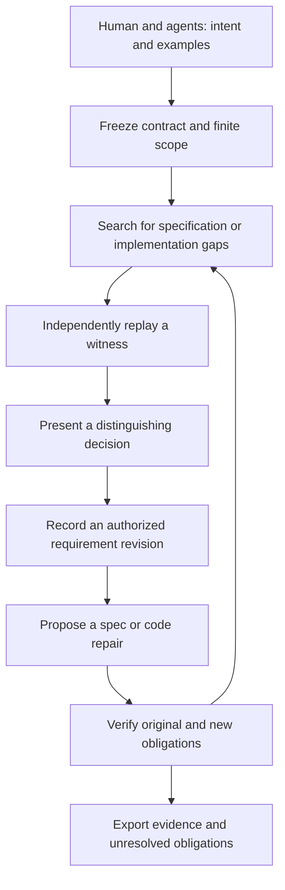

# ZenoLacuna

Find the missing requirement.

**Status:** candidate design, version 0.1, 2026-09-08.
**Delivery:** design, brand asset, acceptance contract, and implementation packets.
**Product:** a neurosymbolic workbench for finding and repairing specification gaps.
**Claim boundary:** correctness and completeness are scoped to explicit semantics,
assumptions, observations, requirements, and evidence. Human intent is an external
input. A design document and a passing scenario inventory are not a verified tool.

ZenoLacuna helps a developer and their agents discover when two implementations
meet the current specification yet produce materially different outcomes. It
turns a checked disagreement into a concrete requirements decision, then carries
the decision through specification repair, implementation repair, and replay.

## Deliverables

- This document defines the proposed product and formal contract.
- [Acceptance contract](acceptance.md) defines BDD scenarios and independent oracles.
- [Scenario catalog](scenarios.json) gives agents stable obligations and case IDs.
- [Implementation packets](implementation.md) assign work and acceptance gates.
- [Logo and identity](brand.md) records the generated asset and its prompt.
- [Design review](review.md) records review findings and their resolution.

## Intent and authority

| Decision | Origin | Status | Consequence |
| --- | --- | --- | --- |
| Design a named tool with a logo and implementation assignments | User | Approved for this delivery | Deliver a concrete handoff |
| Users include a human with an LLM or agent swarm | User | Approved | Both human explanations and machine interfaces are required |
| Detect missing requirements as well as code defects | User and preceding discussion | Design requirement | Passing the written spec alone cannot close the task |
| Use a finite first milestone | Design proposal | Candidate | Scope claims to the declared finite model |
| Keep acceptance independent of model opinions | Repository authority doctrine | Required | A model verdict cannot produce verified evidence |
| Local CLI and library before a service | Design proposal | Candidate | No accounts or network service are needed for the first implementation |

This delivery authorizes design work and its local validation. Existing session
authorization for local research and implementation persists; this document does
not independently start a goal or a worker. The product never grants trading,
settlement, signing, deployment, or Tau Net admission authority. Future executors
must preserve applicable session authority rather than invent new approval gates.

## The concrete failure we target

The existing AutoTrader byte codec supplies functions E and D with
`D(E(x)) = x` for all 128 semantic metadata words. Construct, in memory:

```text
E2(x) = E(x) XOR 1
D2(w) = D(w XOR 1)
```

Both complete pairs round-trip all 128 words. Both mixed-version pairings
misdecode all 128 words. This deliberately altered pair demonstrates that a
round-trip-only contract omits a compatibility decision. It is not a defect
claim about the published adapter. Reproduce the example with
`python3 examples/codec_gap.py` from this directory; it emits JSON to stdout.

For a release engineer and their swarm, the useful question is which producer,
consumer, and queued-message versions must interoperate. The answer changes a
contract. A wording preference that changes no observable behavior does not.

## Product behavior

The developer supplies source roots, candidate formal requirements, approved
examples, effect/authority boundaries, a finite domain, and a list of observations
that matter. Agents can propose extra predicates, missing state variables,
alternative implementations, and candidate questions. All proposals are data.



There are three distinct repairs. A code counterexample changes implementation.
A missing requirement changes the intended contract through its responsible
owner. A runtime trace absent from the model changes the model and invalidates
dependent evidence. They must not be silently substituted for one another.

The first UI is a CLI with a narrow library API. Every command has stable JSON
output and a concise human rendering. Questions include the concrete scenario,
observed alternatives, the exact contract change for each answer, and a path to
say that none of the offered interpretations fits. Already authorized policy
can answer a question without interrupting the user. A model-generated policy
does not become authorized merely by being placed in an answer file.

## Formal object

Freeze the following as one immutable `Scope` value:

```text
Scope = (source_root, semantics_root, D, A, O, K, H, Q, M, limits)
```

- `D`: a finite set of contexts and outcome/trace encodings, with an exact
  enumeration or checked symbolic encoding. A trace-length bound is part of D.
- `A`: environment assumptions, with declared applicability and witnesses.
- `O`: the observable projection, including rejection, effects, and terminal
  state where relevant. Its runtime correspondence is a separate obligation.
- `K`: protected, approved requirements and required successful behaviors.
- `H`: a declared finite family of possible contract interpretations.
- `Q`: a finite question language. Each question partitions interpretations by
  a deterministic, independently checked answer relation.
- `M`: declared omission and mutation families used for evaluation.
- `limits`: work and representation limits; exhaustion remains inconclusive.

For the initial relational profile, an interpretation h is a Boolean predicate
`Allowed_h(context, outcome)`. Its semantic identity is the complete allowed
relation over D and O, not a source string or one representative execution.
Intentional nondeterminism is represented by a set of allowed outcomes.

Each protected requirement in K includes its original applicability predicate
over D, required reachability classes, and expected success/rejection relation.
Preserving one positive example does not preserve the supported domain. A repair
must cover every protected applicability class without adding assumptions that
exclude it. An explicit owner decision may change that contract, but starts a
new requirement revision and cannot count as a correctness-preserving repair.

Candidate source code is executed only by the existing restricted workbench
interpreter or a separately isolated, explicitly selected replay adapter. The
checker never imports arbitrary agent-generated Python. Handwritten integration
fixtures call known repository adapters through an explicit allowlist.

### Core obligations

| ID | Obligation | Evidence required for the first milestone |
| --- | --- | --- |
| ZL-01 | Every accepted witness actually satisfies its stated premises and distinguishes the stated behavior | Independent finite evaluator |
| ZL-02 | Equal semantic classes have equal complete allowed relations under O | Exhaustive relation comparison |
| ZL-03 | A question response retains exactly the compatible interpretations | Exhaustive filter oracle and refinement proof target |
| ZL-04 | Protected K and required positive behavior cannot disappear through repair | Implication and reachability checks against the previous revision |
| ZL-05 | Code behavior refines the approved specification on D under A | Independent runtime/model parity plus finite checking |
| ZL-06 | Closure cannot be produced with missing obligations, stale evidence, unsupported semantics, or unresolved material decisions | Typed transition gate and negative controls |
| ZL-07 | Rejected, stale, duplicate-conflicting, or unauthorized commands have no semantic effect | Complete state/effect/history observation |
| ZL-08 | Every promoted model result names a checked runtime correspondence, or remains MODEL_ONLY | Source-bound one-step and bounded-history parity |
| ZL-09 | Question selection preserves all consistent interpretations and its optimality label is truthful | Independent small dynamic-programming oracle |
| ZL-10 | Cancellation and restart cannot revive obsolete decisions or partially promote a revision | Stateful replay with interrupted writes |

The candidate correctness chain is:

```text
runtime traces under A -> checked model observations in D
model/code behaviors in D -> approved specification
approved specification in D -> protected requirements K
```

Every arrow needs evidence. Source hashes bind artifacts but do not prove an
arrow. The second and third implications alone cannot establish that K captures
all human intent. No implication may become true solely because A is inconsistent
or required successful behavior has been excluded.

## Question-selection algorithm

Let V be the surviving interpretations. Quotient V by equality of their complete
allowed relations. A question is useful only if it separates at least two classes.
For a valid response a, retain exactly `V' = {h in V : answer(q,h) = a}`.

`answer(q,h)` must be total on V and constant on every semantic equivalence class.
Check that property before constructing a quotient-level question. A question
about syntactic spelling or irrelevant implementation identity is not admissible
in this language. If it actually concerns a missing user observation, expand O
through a new scope revision rather than silently splitting an existing class.

For at most 12 classes and 32 questions, use exact dynamic programming:

```text
C(V) = 0                                      if V has one semantic class
C(V) = min_q (cost(q) + max_a C(V[q,a]))       over strict separating questions
```

Question costs are explicit positive integers. Empty answer partitions are
excluded. An unseparable nonsingleton has cost infinity, represented by an exact
tagged result rather than a floating-point value. Any question with an
unseparable child also has infinite worst-case cost. If all questions have that
cost, return `UNSEPARABLE_IN_LANGUAGE`; a useful first split does not imply a
finite complete policy. An empty V is a conflict, never completion. Break
equal costs by stable question ID. The full state/work budget must be checked
before reporting `EXACT_MINIMAX`; partial search cannot receive that label.

Larger families use a deterministic greedy partition heuristic, explicitly
labeled `HEURISTIC`, or remain inconclusive if their representation exceeds the
profile. Learned ranking may prioritize witness discovery and suggest new
questions. It does not prune interpretations or alter exact question costs.

An answer outside the available meanings returns `NEEDS_MODEL_REVISION` and
preserves the prior version. An absent answer leaves `NEEDS_DECISION`. A stored
answer binds the question, witness, parent revision, policy/owner decision, and
expected revision. Changes to H, A, O, or K start a new scope and recheck all
dependent evidence. Late answers cannot apply to the new scope.

**Theorem targets, currently unproved:** finite answer filtering preserves a
true interpretation when it is in H and the answer oracle is faithful; strict
separating answers remove at least one semantic class; exact DP minimizes worst
case declared question cost over Q. These results do not bound witness acquisition
cost or establish that the intended contract is in H. Logarithmic question counts
require suitable separators and are not promised in general.

## Architecture and trust boundary

| Component | Responsibility | Authority |
| --- | --- | --- |
| `model` | Frozen owned types, closed variants, scope and lifecycle | Describes data only |
| `relations` | Finite relational semantics and semantic equivalence | Deterministic reference core |
| `questions` | Partition construction and exact/heuristic scheduling | Advisory choice; checked filtering |
| `check` | Witness replay, preserved obligations, closure construction | Owns opaque verified result constructors |
| `ports` | Typed Tau, ESSO, SMT, runtime and proof-adapter contracts | Returns evidence candidates |
| `shell` | Files, process isolation, revision compare-and-swap, atomic output | Applies explicit core effect plans |
| `cli` | Human and stable JSON interface, capability discovery | No independent acceptance logic |
| `proposals` | LLM/swarm prompts and source-context preparation | Advisory only |

The initial implementation is a small Python package using existing repository
dependencies. No new framework, database, Cucumber dependency, or network service
is needed. Keep JSON mappings at decode boundaries and convert to immutable exact
types. Persistence uses append-only revisions plus an atomic current-revision
pointer owned by the shell. Crash recovery verifies the last complete record.

Expose separate diagnostic axes rather than one global PASS badge:

```text
workflow: DRAFT | ANALYZING | NEEDS_DECISION | NEEDS_MODEL_REVISION |
          REPAIR_REQUIRED | READY_FOR_REPLAY | COMPLETE_FOR_SCOPE |
          INCONCLUSIVE | CANCELLED
evidence: PROOF_CHECKED | EXHAUSTIVE_FINITE | BOUNDED_SEARCH | MODEL_ONLY | UNKNOWN
scope:    FINITE_RELATION | FINITE_STATE_GRAPH | BOUNDED_HISTORY
authority: NONE
```

`COMPLETE_FOR_SCOPE` requires every declared obligation closed at its required
evidence grade, no unresolved material decision, a nonempty consistent semantic
class or explicitly approved allowed family, valid positive/rejection witnesses,
fresh source and runtime bindings, and independent replay. It makes no statement
outside that exact scope. An approved allowed family must itself be represented
as a contract; unresolved disagreement cannot be relabeled nondeterminism.

For histories, an allowed family denotes a union of complete permitted traces,
or an explicit choice of interpretation fixed for the run. It is not a per-step
union of transitions. For example, contracts permitting only `00` or only `11`
do not jointly permit `01`. A projection or quotient must preserve the state
needed to enforce this correlation; otherwise its result is MODEL_ONLY.

Runtime correspondence requires either exhaustive enumeration of the declared
concrete runtime input/trace domain, or a checked simulation argument covering
all concrete cases represented by a symbolic class. Selected fixtures and
representative boundary values cannot prove that argument. Without it, report
the narrower fixture/finite domain and keep broader runtime claims MODEL_ONLY.

## Tau, ESSO, and other tools

Tau provides supported Boolean specification composition, satisfiability and
quantifier-elimination procedures. Existing Tau workbench components provide
finite source analysis, behavioral equivalence, candidate composition, and
final checks against the original contract. ZenoLacuna adds explicit omission
families, checked separating questions, and repair of the intended contract.

Tau queries must preserve temporal quantifier order. An arbitrary satisfying
trace is not a causal controller. Residual quantifiers, unsupported queries,
process failures, or output disagreement remain UNKNOWN. Native answers in the
finite first profile receive an independent exhaustive check. Native Tau output
alone is not a separately checked proof certificate.

ESSO is useful for finite transition models, inductive invariants, declared
observational refinement, and constrained guard synthesis. Use `guide` before
the selected workflow and `verify-multi` where that profile requires it. A
bounded prefilter or sampled parameter check is not exhaustive evidence. An
ESSO failure due to missing tools or timeout maps to an inconclusive evidence
reason here; it never permits a repair. Solver agreement does not establish
runtime fidelity or independent proof checking.

Use SMT for finite arithmetic/bitvector witnesses and replay SAT witnesses in
the independent evaluator. Use Lean for the filtering, DP, and closure-soundness
theorem targets. Use a complete finite transition graph or an appropriate
temporal checker for liveness, with explicit fairness. A length-k history search
only supports a length-k claim. ESSO one-step refinement alone cannot certify
queued-message or crash/retry liveness.

Tau Net integration is a later adapter for exchanging scoped evidence and
requirements decisions. Network consensus does not decide whether an unwritten
human requirement is correct. The first milestone is entirely local.

## First two implementation milestones

**M0: finite contract ambiguity.** Use the actual 8-bit codec functions and a
small declared family of missing compatibility/field/rejection constraints.
Search alternative implementations that satisfy a weakened contract, show the
disagreement, record a simulated authorized decision, and check a repaired
contract. Cover all 256 byte values, distinguishing the 128 metadata words from
reserved values. Do not conflate these with the 14 accepted observation profiles.

**M1: finite adapter migration.** Model producer version, consumer version,
one queued message, explicit schema, retry state, and cancellation/rollback.
Use a finite set of real V1/V2 payload fixtures and record exact runtime parity.
Analyze complete finite graphs only within declared state limits. Infinite
queues, arbitrary strings, concurrency outside the model, and production
deployment remain outside the claim. Required positive paths include old-reader
support when requested, consumer-first adoption, and recovery from rejected
input. Missing freshness/authentication fields must not vanish from O.

## Evaluation and prior art

Compare on the same frozen corpus: existing tests and Tau workbench, ordinary
exhaustive/SMT checking with fixed questions, and ZenoLacuna. Retain the simplest
correct baseline. Add a learned proposer only after the deterministic loop has
an independent oracle. Separate model-call costs, witness-search cost, question
count, replay cost, and artifact bytes. No speed or productivity gain is assumed.

The review team owns held-out omission combinations and semantic mutants. The
implementer receives public development scenarios, not the hidden answers.
Report confirmed recovered omissions, missed omissions, false closure, unknown
results, spurious witnesses, questions, and total resources. Zero false closures
is a hard gate on the evaluated suite, not a universal correctness theorem.

The mechanism draws on [oracle-guided inductive synthesis](https://arxiv.org/abs/1505.03953),
[vacuity detection](https://cris.huji.ac.il/en/publications/vacuity-detection-in-temporal-model-checking-13/),
and [Tau specification algebra](https://github.com/IDNI/tau-lang/blob/main/README.md).
The finite ambiguity geometry, question policy, and end-to-end runtime binding
are the proposed research integration. Novelty and superior economics remain
hypotheses. Use public APIs and original glue; no Tau internals are copied or
redistributed by this design. Existing license and patent boundaries persist.

## Completion of this design delivery

The design delivery is complete when the architecture, scenarios, model routing,
logo, illustrative replay, and independent design review are saved and mutually
consistent. Product implementation remains a separate stage with the M0/M1
acceptance gates above. Review status, exact local checks, and remaining limits
are recorded in [review.md](review.md).
