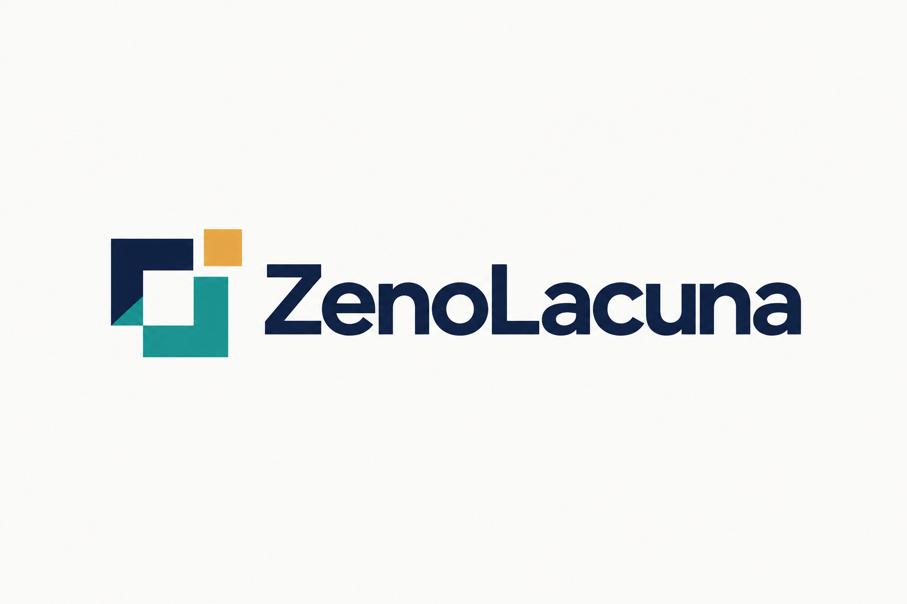

# ZenoLacuna identity

**Name:** ZenoLacuna.
**Line:** Find the missing requirement.
**Working namespace:** `zenolacuna`.

The name connects the Zeno project family with the gap the tool makes visible.
The symbol uses two interlocking paths around a clear opening and an amber
piece at the open boundary. The paths represent complementary reasoning and
checking; the amber piece represents a requirement brought into view.

The selected artifact is a 1536 by 1024 RGB PNG on a light opaque background.
It was generated with the built-in image-generation tool and then refined with
that tool to improve contrast and remove transparency/glow. It is a raster
brand asset, not a hand-authored SVG or an assurance seal. Use it on light
backgrounds. A production vector master and dark-background variant would be
separate assets.

Suggested identity colors are navy `#14213D`, teal `#168D86`, amber `#E8AB45`,
and warm white `#FAFAF7`. Generated pixels approximate these targets. The
wordmark reads `ZenoLacuna`, with capitals Z and L. Keep clear space around the
mark and avoid shrinking the wordmark below comfortable reading size.

The working name was selected after a small public collision search. This is
not a name-availability, trademark, or patent clearance result. The logo does
not use Tau's official mark or assert affiliation with Tau's creators.

## Generation prompt

Create one polished original logo for a formal software research tool named
ZenoLacuna. Use case: logo-brand. The tool helps a human and an agent swarm
discover missing requirements in specifications. Deliver a single horizontal
logo lockup centered on a clean warm-white (#FAFAF7) canvas, generous whitespace,
crisp flat geometric vector-like rendering, ready to place in a technical
project README. The symbol at left consists of two simple interlocking angular
paths, one deep midnight navy (#14213D) and one muted teal (#168D86), framing a
clear small square of negative space. A single small amber (#E8AB45) square
segment completes a deliberate gap in the outline. The whole mark should read
as a precise, memorable abstract aperture or missing-piece motif, balanced and
legible at small sizes, with no more than six geometric components. To the
right put the exact word 'ZenoLacuna' in a refined contemporary humanist
sans-serif wordmark, navy, medium weight, carefully spaced, with capital Z and
L as written. No tagline or additional text. No gradients, shadows, 3D, mockup
objects, brains, robots, circuit-board decoration, shields, padlocks, checkmarks,
official Tau logos, or borrowed brand motifs. Prioritize sophisticated
simplicity and clear negative space. Landscape canvas, roughly 3:2 aspect ratio;
the complete lockup occupies the middle half of the image, with ample clear
margins.

## Refinement prompt

Edit this logo's rendering only. Preserve the exact word ZenoLacuna, its
typography, the geometry and placement of the symbol, and the horizontal layout.
Make this a flat, fully opaque print-ready logo on a solid warm-white background
(#FAFAF7). The entire canvas including all four corners must be opaque, with no
transparency. Remove all glow, halos, shadows, blur, haze, gradients and
translucent pixels around and inside the logo. Render the letterforms in solid
dark navy (#14213D) with sharp crisp edges, the left symbol in solid navy and
teal (#168D86), and the small square in solid amber (#E8AB45). Uniform fill colors,
high contrast, clean white negative space. Do not add or remove text. Do not
change the design or add any embellishments.
